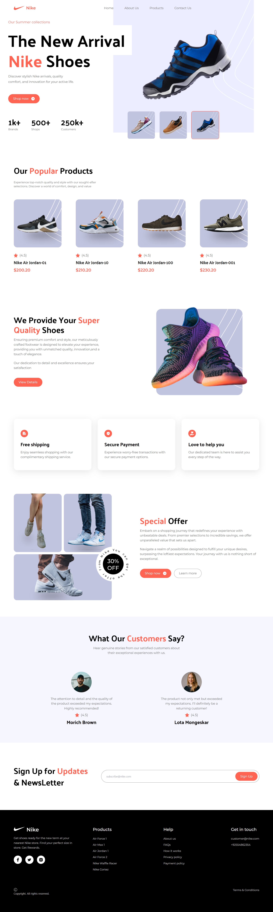

# NIKE REPLICA

<p align="center">
  
</p>

## 🌐 LIVE DEMO

**[👉 Live Demo](https://nike-replica-blond.vercel.app/)**

Nike Replica is a modern, responsive single-page web application that faithfully recreates the look and feel of Nike's official website. Built using React and Tailwind CSS, this project showcases high-quality design implementation, smooth user experience, and dynamic components including product highlights, customer reviews, and promotional offers.

## ✨ FEATURES

- **Pixel-Perfect UI:** Meticulously crafted to match Nike's sleek, modern aesthetic
- **Fully Responsive Design:** Optimized for all device sizes from mobile to desktop
- **Interactive Elements:** Dynamic navigation, product carousels, and hover effects
- **Performance Optimized:** Fast loading times and smooth interactions
- **Clean, Maintainable Code:** Well-structured codebase following best practices

## 🛠️ TECH STACK

- **React** - Component-based UI development
- **Tailwind CSS** - Utility-first styling approach
- **JavaScript (ES6+)** - Modern JS features and syntax
- **Vite** - Next generation frontend tooling
- **Vercel** - Deployment and hosting

## 📁 PROJECT STRUCTURE
```
PS D:\NIKE\nike-replica> Show-Tree
├─ public
  ├─ favicon.ico
├─ src
  ├─ assets
    ├─ icons
      ├─ arrow-right.svg
      ├─ chevron-left.svg
      ├─ chevron-right.svg
      ├─ copyright-sign.svg
      ├─ facebook.svg
      ├─ hamburger.svg
      ├─ index.js
      ├─ instagram.svg
      ├─ shield-tick.svg
      ├─ star.svg
      ├─ support.svg
      ├─ truck-fast.svg
      ├─ twitter.svg
    ├─ images
      ├─ big-shoe1.png
      ├─ big-shoe2.png
      ├─ big-shoe3.png
      ├─ collection-background.svg
      ├─ customer1.jpeg
      ├─ customer2.svg
      ├─ footer-logo.svg
      ├─ header-logo.svg
      ├─ index.js
      ├─ offer.svg
      ├─ shoe4.svg
      ├─ shoe5.svg
      ├─ shoe6.svg
      ├─ shoe7.svg
      ├─ shoe8.svg
      ├─ thumbnail-background.svg
      ├─ thumbnail-shoe1.svg
      ├─ thumbnail-shoe2.svg
      ├─ thumbnail-shoe3.svg
  ├─ components
    ├─ Button.jsx
    ├─ index.js
    ├─ Nav.jsx
    ├─ PopularProductCard.jsx
    ├─ ReviewCard.jsx
    ├─ ServiceCard.jsx
    ├─ ShoeCard.jsx
  ├─ constants
    ├─ index.js
  ├─ sections
    ├─ CustomerReviews.jsx
    ├─ Footer.jsx
    ├─ Hero.jsx
    ├─ index.js
    ├─ PopularProducts.jsx
    ├─ Services.jsx
    ├─ SpecialOffer.jsx
    ├─ Subscribe.jsx
    ├─ SuperQuality.jsx
  ├─ App.jsx
  ├─ index.css
  ├─ main.jsx
├─ .gitignore
├─ eslint.config.js
├─ final.png
├─ index.html
├─ package-lock.json
├─ package.json
├─ postcss.config.cjs
├─ README.md
├─ tailwind.config.js
├─ vite.config.js
```


## 🧩 PROJECT STRUCTURE EXPLAINED

- **`src/components/`**: Reusable UI components used throughout the application
  - `Button.jsx`: Custom button component with various styles
  - `Nav.jsx`: Navigation bar with responsive mobile menu
  - `PopularProductCard.jsx`: Card component for displaying popular products
  - `ReviewCard.jsx`: Component for customer testimonials
  - `ServiceCard.jsx`: Card displaying Nike services
  - `ShoeCard.jsx`: Interactive shoe display component
  
- **`src/sections/`**: Major page sections that compose the landing page
  - `Hero.jsx`: Main banner section with featured product
  - `PopularProducts.jsx`: Showcases popular Nike products
  - `SuperQuality.jsx`: Highlights product quality features
  - `Services.jsx`: Displays Nike's service offerings
  - `SpecialOffer.jsx`: Promotional section for special deals
  - `CustomerReviews.jsx`: Displays customer testimonials
  - `Subscribe.jsx`: Newsletter subscription section
  - `Footer.jsx`: Page footer with links and information

- **`src/constants/`**: Contains application constants and data
  - `index.js`: Defines navigation links, products, services, and other static content

## 🎯 IMPLEMENTATION HIGHLIGHTS

- **Component Architecture**: Clean separation of UI elements into reusable components
- **Modern React Patterns**: Using hooks and functional components throughout
- **Responsive Design**: Mobile-first approach with Tailwind's responsive utilities
- **Interactive Elements**: Dynamic state management for interactive UI components
- **Performance Optimization**: Efficient rendering and asset optimization

## 📱 RESPONSIVE BEHAVIOR

- **Mobile-First Approach**: Designed primarily for mobile devices, then scaled up
- **Breakpoint Optimization**: Tailored layouts for mobile, tablet, and desktop viewports
- **Touch-Friendly Controls**: Larger tap targets and swipe gestures for mobile users

## ✅ KEY FEATURES IMPLEMENTED

1. **Hero Section**: Dynamic shoe showcase with interactive thumbnail selection
2. **Popular Products**: Grid layout showcasing featured Nike shoes
3. **Quality Commitment**: Section highlighting Nike's quality standards
4. **Services**: Cards displaying Nike's customer services
5. **Special Offers**: Promotional section with compelling call-to-action
6. **Customer Reviews**: Testimonials from satisfied customers
7. **Newsletter**: Email subscription section
8. **Footer**: Comprehensive footer with navigation links

## 🤝 CONTRIBUTING
Contributions are welcome! Feel free to submit a pull request or open an issue to suggest improvements or report bugs.

- Fork the repository
- Create your feature branch (git checkout -b feature/amazing-feature)
- Commit your changes (git commit -m 'Add some amazing feature')
- Push to the branch (git push origin feature/amazing-feature)
- Open a Pull Request

## 🙏 ACKNOWLEDGEMENTS
- [JSMastery](https://github.com/adrianhajdin) - For the source code and video tutorial
- Nike - For design inspiration
- React - Frontend library
- Tailwind CSS - CSS framework
- Vite - Frontend tooling
- Vercel - Hosting platform
